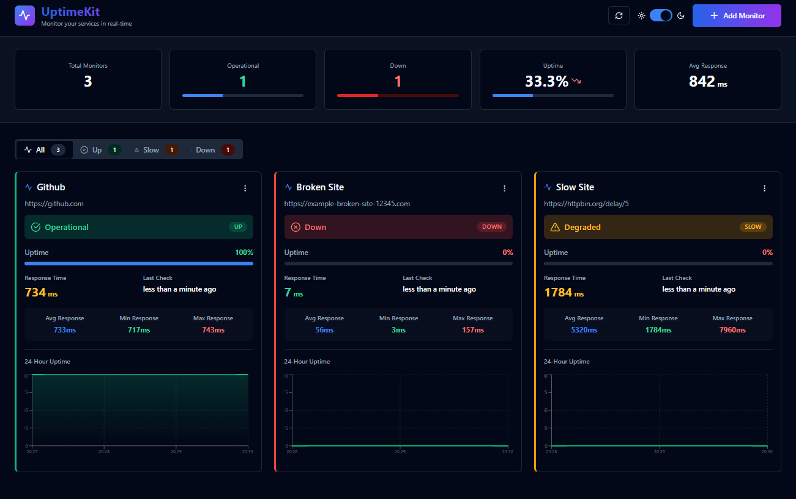

# UptimeKit 🚀

A simple uptime monitoring dashboard to keep track of your websites and APIs. Get real-time updates, beautiful charts, and know exactly when something goes down.

## Preview 



## Features ✨

- Real-time monitoring - checks every minute
- Individual charts for each monitor
- Track response times (avg, min, max)
- Beautiful dark/light mode
- Mobile responsive - works everywhere
- Edit or delete monitors anytime
- Pause monitoring without losing data
- See exactly when something goes down
- Auto-refreshes every 30 seconds

## Status Colors

- 🟢 **Operational** - Response time < 1000ms
- 🟡 **Degraded** - Response time 1000-5000ms
- 🔴 **Down** - Service unavailable or response time > 5000ms

## Getting Started 🎯

### Prerequisites
- Node.js (v14 or higher)
- npm or yarn

### Installation

```bash
# Clone the repository
git clone https://github.com/abhixdd/UptimeKit.git
cd UptimeKit

# Install all dependencies (root, backend, frontend)
npm run install:all
```

### Running the Application

```bash
npm run dev
```

This runs both backend (port 3000) and frontend (port 5173) concurrently.

Open browser: `http://localhost:5173`

**Optional:** Create a `.env` file in the `backend` folder (copy from `.env.example`) to customize the port or other settings.

## API Endpoints 📡

- `GET /api/monitors` - Get all monitors
- `POST /api/monitors` - Create monitor
- `PUT /api/monitors/:id` - Update monitor
- `DELETE /api/monitors/:id` - Delete monitor
- `PATCH /api/monitors/:id/pause` - Toggle pause
- `GET /api/monitors/:id/chart/uptime` - Uptime chart data
- `GET /api/monitors/:id/chart/response-time` - Response time chart data
- `GET /api/monitors/:id/history` - Last 30 checks

## Usage 📖

1. Click "Add Monitor" to add a new website/API to monitor
2. Enter a name and URL (e.g., https://example.com)
3. Monitor status updates automatically every minute
4. View charts, pause, edit, or delete monitors from the menu

## Contributing 🤝

Contributions are welcome! Please feel free to submit a Pull Request.

## License 📄

This project is licensed under the MIT License.

## Support 💬

If you encounter any issues, please open an issue on GitHub: [GitHub Issues](https://github.com/abhixdd/UptimeKit/issues)

## Author 👨‍💻

**Abhi** - [GitHub Profile](https://github.com/abhixdd)

---

**Made with ❤️ for monitoring enthusiasts**

Star ⭐ the repository if you find it helpful!
